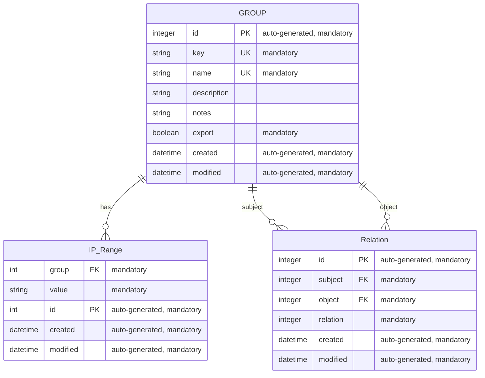

# IP Manager Model in Django

## Additional Information

### Group

* The key and name fields are indexed, which means that they make it easy for lookup.

### IPRange

* Group and value are composite keys

### Relation

* subject and object are composite foreign keys
