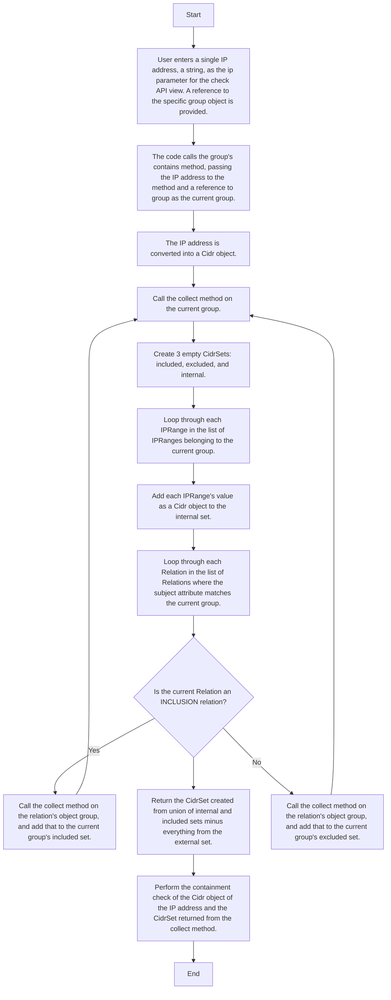

# Documentation for the IP Containment Check Method Re-Implementation

## Flowchart

This diagram depicts the high-level sequence of steps that the code performs
when a user asks to check if a single IP address is in a specific group.

