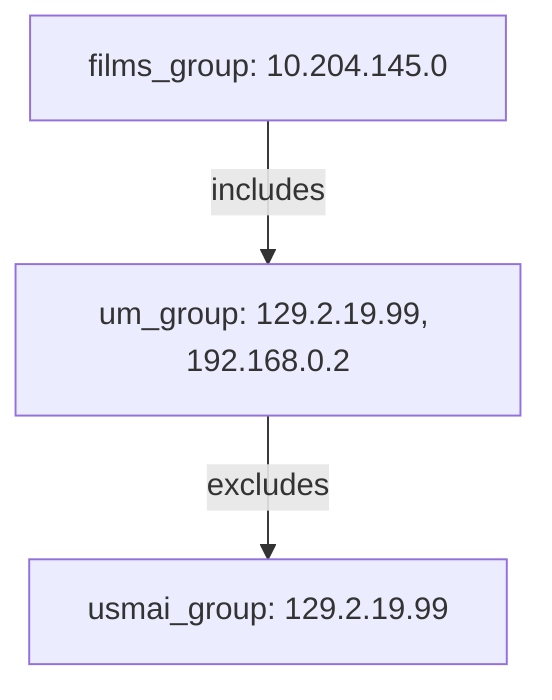
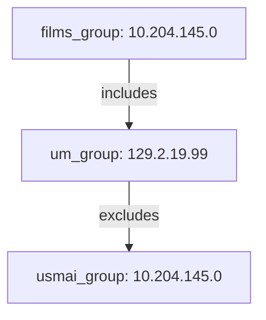
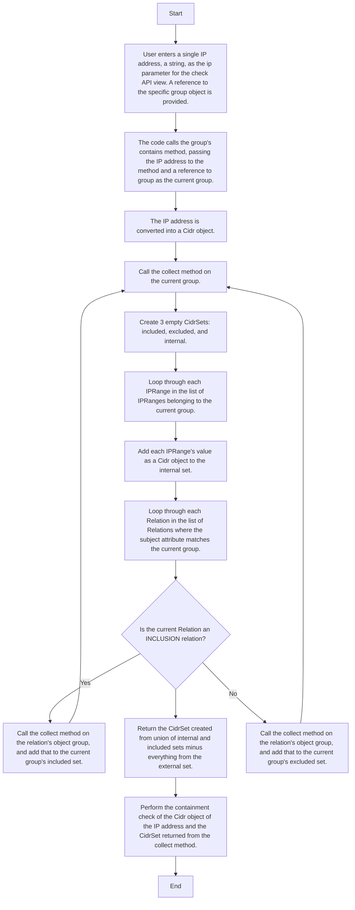

# Documentation for the IP Containment Check Method Re-Implementation

This code is part of a system used to manage IP addresses and IP ranges (like CIDR blocks). The main goal of the function, ```def __contains__(self,ip)``` is to check if a specific IP address belongs to a group of IPs after applying some rules. These rules decide which IPs should be included or excluded from the group.

## Description

The contains function calls collect which will compile a set of all of the IP addresses in the group. The collect function starts off by creating three CidrSets: one for the internal IP addresses ```internal_set```, one for the included IP addresses ```included_set``` and one for the excluded IP addresses ```excluded_set```. After adding all IP ranges to the internal set, the code looks at all the groups connected to the current group and checks to see the relationship between them. If a group is included in the current group self, all of its IP addresses are added to the included set by recursively calling collect on it. Similarly, if a group is excluded from self, all of its IP addresses are added to the excluded set by recursively calling collect on the group. Once all the groups have been processed, the function combines everything into a final list of the internal and included IP ranges without any of the excluded ones. Finally it checks if the given IP list is in its final IP range and returns ```True``` or ```False```.

## Special Case

In order for this method to work properly, any IP ranges that are excluded must be present in a group's internal or included IP ranges. This is because subtracting IP ranges from an empty set or a set where they don't exist will have no effect.

## Examples

### Standard

Each groups internal IP ranges are listed beside them.



If we check if **129.2.19.99** is in ```films_group``` the contains function will be called which will call collect on ```films_group```.

**In films_group collect():** This will cause **10.204.145.0**  to be added to ```internal_set```. The loop starts with ```um_group``` being the only related group. Since it's type is INCLUSION, anything returned from calling collect on it will be added to the ```included_set```.

**In um_group collect():** The ```um_group``` will have  **129.2.19.99** and **192.168.0.2** be added to it's ```internal_set```. Now the loop will look at ```usmai_group``` and call collect on it.

**In usmai_group collect():** The ip address **129.2.19.99** in will be added to its ```internal_set```.

**Returning back:** The final set from ```usmai_group``` is returned to the ```external_set``` of the ```um_group```. The ```um_group``` has no more related groups and returns its ```internal_set``` minus the ```excluded_set``` which would be **129.2.19.99** and **192.168.0.2** minus **129.2.19.99** which is just **192.168.0.2**. This is returned back to ```films_group``` ```included_set```. Now the ```internal_set``` and ```included_set``` are added to get a final Cidr set of **10.204.145.0** and **192.168.0.2**. Since **129.2.19.99** is not in this set, ```False``` is correctly returned from the contains method.

### A Special Case

Each groups internal IP ranges are listed beside them.



If we check if **10.204.145.0** is in ```films_group``` the contains function is called which will call collect on ```films_group```.

**In films_group collect():** Just like the previous example, **10.204.145.0**  will be added to ```internal_set``` and the loop will start by looking at the ```um_group```.

**In um_group collect():** The ```um_group``` ip address **129.2.19.99** will be added to its ```internal_set```. Now the loop will go to the ```usmai_group``` and call collect on it.

**In usmai_group collect():** The ip address **10.204.145.0** will be added to its ```internal_set``` and will become the final set for ```usmai_group```.

**Returning back:** The final set for ```umsai_group``` is returned to the ```excluded_set``` of the ```um_group```. The ```um_group``` has no more groups to loop through so it returns its ```internal_set``` minus the ```excluded_set``` which would be **129.2.19.99** minus **10.204.145.0** which is just **129.2.19.99**. The excluded group ```usmai_group``` had no effect because it's ip address wasn't in ```um_group```. Now the ```um_group``` final set is returned back to ```films_group``` ```included_set```. There is no indication that **10.204.145.0** was ever excluded. The ```internal_set``` and ```included_set``` are added to get a final Cidr set of **10.204.145.0** and **129.2.19.99**. Since **10.204.145.0** is in this set, ```True``` is returned from the contains method. This is why the ip ranges in an excluded group must be present in it's parent's internal or included ip ranges for it to have the right effect.

## Flowchart

This diagram depicts the high-level sequence of steps that the code performs when a user asks to check if a single IP address is in a specific group.


