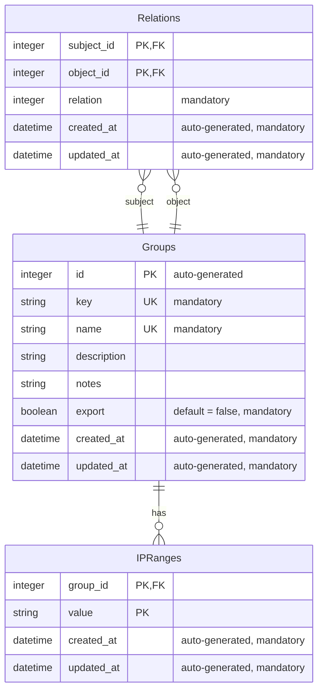

# ERD For Ruby version of IPManager

# Additional Information
* All of the datetime fields, such as created_at and updated_at, should have a precision of 6 and they are non-null.
## Groups
* The key and name fields are indexed, which means that they make it easy for lookup.
## IPRanges
* The group_id field is indexed.
* The combination of the group_id and value fields is indexed and unique.
## Relations
* The subject_id and object_id fields are indexed.